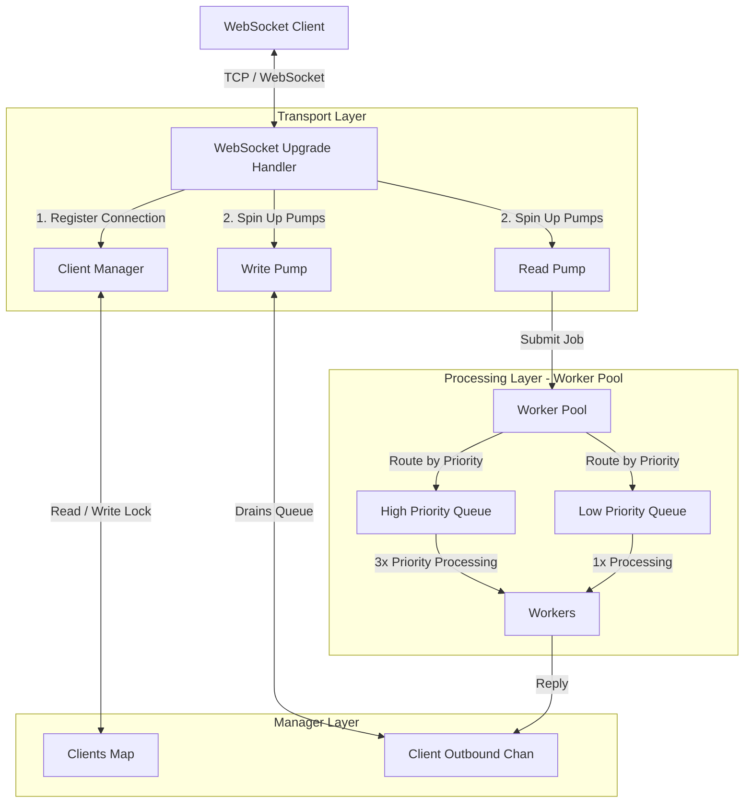

# WebSocket Connection Manager

A high-performance, concurrent, priority-aware WebSocket connection manager and processing engine written in Go. This service implements dedicated read/write pumps per connection, non-blocking outbound messaging, and a weighted-priority worker pool to decouple network I/O from backend job execution.

---

## Architecture Overview



### Components

1. **`internal/transport`**: Upgrades standard HTTP connections to Gorilla WebSockets, generates unique Client UUIDs, registers clients with the manager, and runs the read/write pumps.
2. **`internal/manager`**: Manages registration/unregistration of clients, stores client connections safely in a thread-safe map, handles non-blocking outbound message routing (`SendMessage`), and executes graceful shutdown drains.
3. **`internal/worker`**: Implements a priority-aware worker pool containing two queues (High Priority & Low Priority). Worker threads prioritize high-priority tasks (e.g., `ping`, `heartbeat`, `close`) over standard processing requests.
4. **`cmd/server`**: Server entrypoint incorporating OS signal monitoring to trigger graceful shutdown.
5. **`cmd/loadtest`**: Simulates high concurrency client stress testing.

---

## Core Mechanisms

### 1. Dedicated Connection Pumps
To prevent slow network readers/writers from blocking other client connections or consuming server CPU resources, each connection runs two dedicated goroutines:
* **`ReadPump`**: Listens for incoming WebSocket messages, resets connection read deadlines (default 10s), and submits messages as jobs to the worker pool.
* **`WritePump`**: Drains the client's internal `MessageChannel` buffer, sets write deadlines (default 5s), and serializes messages over the WebSocket connection.

### 2. Weighted Priority Job Processing
Jobs are classified by priority based on their payload using `priority(message)` in the `manager` package:
* **High Priority (`worker.High`)**: `ping`, `heartbeat`, and `close`.
* **Low Priority (`worker.Low`)**: Standard application payloads.

Workers process tasks using a **3:1 weighted ratio**:
* A worker will process up to 3 consecutive high-priority tasks from the `HighPriorityQueue` before checking the `LowPriorityQueue` for 1 low-priority task, preventing heartbeat latency starvation.

### 3. Non-Blocking Outbound Queuing
To prevent backpressure from dead or slow client connections, `SendMessage` writes to client buffers in a non-blocking manner:
```go
select {
case client.MessageChannel <- message:
default:
    log.Printf("Message queue full, dropping message")
}
```
If the outbound channel (capacity: 100) fills up, messages are discarded to keep the system responsive.

### 4. Graceful Teardown (`Drain`)
Upon receiving `SIGINT` or `SIGTERM`, the server initiates a graceful shutdown sequence:
1. Rejects any new client connection handshakes.
2. Broadcasts a `"Server shutting down"` warning message to all currently connected client outbound buffers.
3. Allows workers to finish processing currently executing jobs.
4. Safely closes the worker pool and exits.

---

## Directory Structure

```text
├── cmd/
│   ├── loadtest/
│   │   └── main.go       # Load-testing client flood simulator
│   └── server/
│       └── main.go       # Main server entrypoint
├── internal/
│   ├── manager/
│   │   ├── client.go     # Client & ClientManager implementation
│   │   └── client_test.go# Unit tests for manager functions & pumps
│   ├── transport/
│   │   ├── server.go     # Upgrade handler and HTTP WebSocket route
│   │   └── server_test.go# Integration tests for ServeWS and connection lifecycle
│   └── worker/
│       ├── pool.go       # Weighted queue worker pool implementation
│       └── pool_test.go  # Unit tests for priority scheduling
├── demo.go               # Single-file standalone WebSocket echo playground
├── go.mod
└── go.sum
```

---

## Getting Started

### Prerequisites
* Go 1.22 or higher
* Packages listed in `go.mod` (e.g., `github.com/gorilla/websocket`, `github.com/google/uuid`)

To download dependencies, run:
```bash
go mod download
```

### Running the Server
To spin up the WebSocket connection manager and processor:
```bash
go run cmd/server/main.go
```
The server will bind to port `:8080` and expose the `/ws` endpoint.

### Running the Load Test
To run the load simulator (which connects client sessions and floods the server with messages):
```bash
go run cmd/loadtest/main.go
```

---

## Testing

The project has robust unit and integration tests covering the worker pool prioritization, manager lifecycles, connection pumps, and WebSocket transport upgrades.

To execute the test suite:
```bash
go test -v ./...
```
